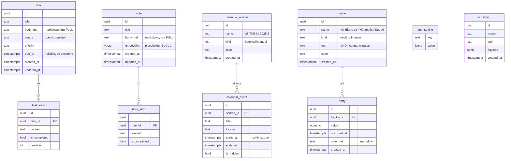

# Schema v1 (mức sơ đồ) — microSched

> **Trạng thái:** A/B/C ✅ **CHỐT 18/07/2026**; chi tiết cột/kiểu làm ở bước sau. Mức **khái niệm**, không phải SQL.
> **Nguồn:** dữ liệu thật v1 + học từ v2 (tham chiếu) + `forward-spec.md` (viewability, AI-first) + retrieval Bước 1.

## 1. Sơ đồ quan hệ

## 2. Thực thể — nói bằng tiếng người

- **task** (+ **task_item**) = việc có deadline + subtask. Xoá task → xoá kèm item (sửa bug mồ côi v1). `body_md` = markdown.
- **note** (+ **note_item**) = ghi chú tự do, có mốc thời gian ("tính thời gian"). `body_md` markdown. `embedding` để Bước 1 cắm semantic search.
- **calendar_source → calendar_event** = nguồn lịch (file TKB/lịch thi) sinh ra các buổi. Re-import = **thay sạch không nhân đôi**. `starts_at/ends_at` **có timezone** (sửa bug v1).
- **tracker → entry** = 🆕 theo dõi **sức khỏe + tài chính** chung một mô hình. tracker định nghĩa "thứ theo dõi" (đơn vị VND hay count); entry là mỗi lần ghi (value + thời điểm). "Chi bia tháng này" / "hút mấy điếu tuần này" = cùng kiểu query, `GROUP BY tracker, khoảng thời gian`.
- **app_setting** = cấu hình `jsonb`. **audit_log** = nhật ký hành động, sẵn cho tool ghi AI (Bước 2) + "log to fine-tune".

## 3. Quyết định đã chốt (A/B/C + markdown)

- **A — Lịch:** ✅ đường giữa — có `calendar_source` + dedup khi re-import, **bỏ** version-history đầy đủ của v2.
- **B — Tracker:** ✅ **làm ngay**, gộp **health + finance** thành `tracker`/`entry` (một mô hình). *Làm phần ghi-log trước; AI phân tích giữ đúng thứ tự sau. Dữ liệu nhạy cảm → bar bảo mật nổi lên khi AI đọc qua LLM bên thứ ba (bookmark Bước 1).*
- **C — task vs note:** ✅ tách riêng.
- **Markdown:** ✅ nguyên tắc — **cấu trúc ở chỗ cần query, markdown ở chỗ viết văn xuôi.** Body/prose (`task.body_md`, `note.body_md`, `entry.note_md`) = markdown; status/deadline/category/unit = cột riêng.

## 4. Đã cố định theo quyết định trước
- Timezone thật ở mọi mốc; text lưu full; FK cascade cho subtask; `pgvector` cho note; `audit_log` dựng sẵn; bỏ "Don't care" event.

## 5. ✅ note_item — đã chốt
- **Gốc lưu dạng bảng/cột** (tick/query được). Markdown chỉ là **lớp trung gian lưu/tương tác**, không phải nơi lưu gốc. Nhất quán với `task_item`.
